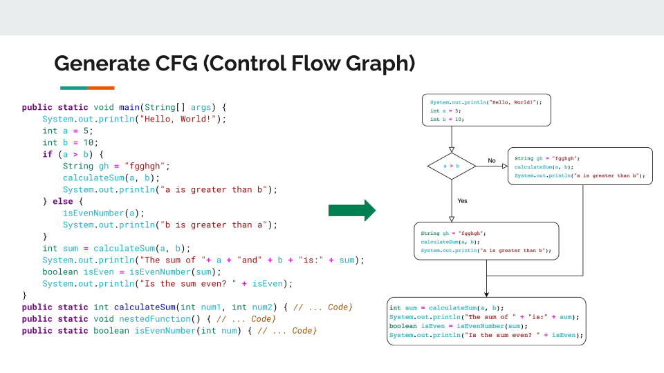
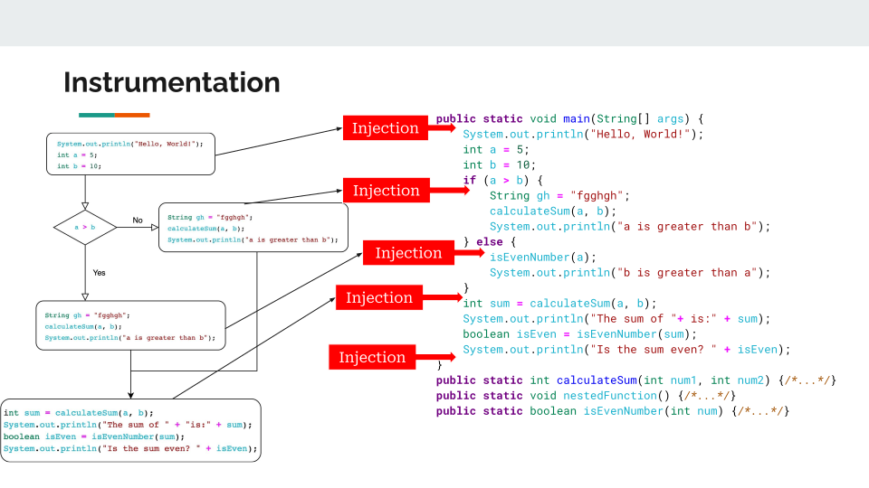
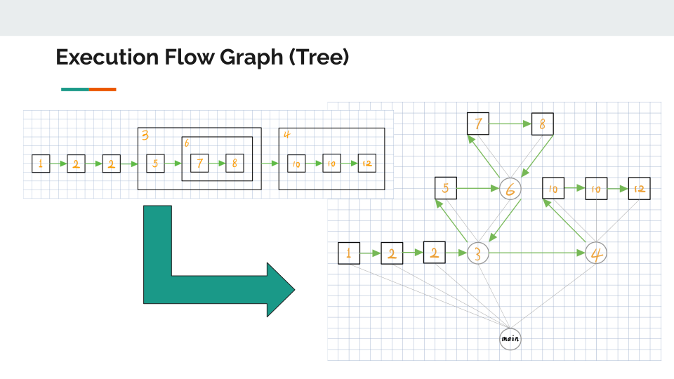

# Java Analysis Tool

This Java Analysis Tool provides in-depth insights into Java programs by creating Control Flow Graphs (CFGs), instrumentation, and presenting execution flow analysis. Users can visualize both static and dynamic aspects of their code's execution, making it a valuable resource for optimization and understanding program behavior.

## Features

- **Static Analysis:** The tool generates CFGs for uploaded Java files, outlining the structure and decision-making paths in the code.
- **Execution Flow Graph (Tree):** A tree structure visualization represents the dynamic call hierarchy and frequency of execution paths, offering insights into the runtime flow.
- **Instrumentation:** Custom logging is injected into the Java bytecode to monitor the execution flow and capture metrics like execution counts and memory usage for each node in the CFG.
- **Dynamic Analysis:** After running the Java file, the tool collects and integrates execution data with the CFG, highlighting runtime behavior and performance metrics.
- **User-friendly Visualization:** Users can interact with the analysis results through an intuitive web interface, gaining a clear understanding of the code's runtime behavior.

## How to Run the Tool

This toos is divided into two main components: the backend analysis and the frontend visualization. The backend analysis is responsible for static and dynamic analysis of the provided Java file, while the frontend visualization displays the results in an interactive format.

- **Backend Analysis**: The backend analysis is implemented in Java, and it performs static and dynamic analysis of the provided Java file.

To run the backend analysis, use the following command:
`./gradlew run`
This will execute the static and dynamic analysis processes.

- **Frontend Visualization**: The frontend visualization is implemented in React

To run the frontend visualization, use the following command:
`yarn start`

This will start the development server and visualization at **localhost:3000** in your default web browser.

### User Flow
The user should begin by uploading the Java file that they want to analyze. After uploading it, a control flow graph (CFG) representation of the 
program will be statically generated on the webpage. 

Next, the user can hit the "execute" button, which runs the dynamic analysis. This assumes a main method is present in the file. 
If there are compilation or runtime errors in your Java file, an error will appear alerting the user of the issue. If
execution was successful, the dynamic analysis information will be appended to each node of the CFG.

## Interpreting the Visualization

The visualization represents a control flow graph of the analyzed Java file's main method, appended with runtime analysis of each node. 
It consists of the following components:

*DETAILS ON FRONTEND HERE*

## Static Analysis Details

The static analysis component of the Java File Analysis Tool focuses on analyzing the structure and behavior of the provided Java code through the following tasks:
### Control Flow Graph (CFG) Generation: 
For each method in the Java file, the tool constructs a CFG where nodes represent statements or blocks of code, and edges represent the flow of control. The CFG is crucial for understanding the program's structure and is used as a basis for further analysis. The construction of the CFG follows these principles:
- 	Entry and Exit Nodes: Each CFG has an entry node at the beginning and an exit node at the end to represent the start and end of the method's execution.
- Statement Nodes: Each executable statement in the method is represented as a node in the CFG.
- Branch Nodes: Conditional statements like if-else create branch nodes with edges leading to different parts of the CFG based on the condition's outcome.
-	Loop Nodes: Loops are represented with nodes for the loop condition and body, with edges that create a cycle to represent the repetitive execution.
### Variable Analysis: 
The tool performs variable analysis on the CFG to identify various issues related to variable usage:
-	Duplicate Declarations: Detects cases where a variable is declared more than once within the same scope or nested scopes, which is not allowed in Java.
-	Undeclared Variable Assignment: Checks if a value is assigned to a variable that has not been declared. This analysis ensures that the variable must be declared in the same or higher scope for the assignment to be considered valid. It does not check for the use of undeclared variables but focuses on assignment operations.
-	Unused Variables: Identifies variables that are declared but never used in the code. This analysis is optimistic, meaning that a variable is considered used if it appears in any branch of a conditional statement or loop, even if there are paths where it is not used.
-	The variable analysis is implemented primarily in the VariableAnalyzer class, which iterates through the statements in the CFG and applies the above checks.
### Branch Analysis: 
The tool analyzes various types of branching constructs to understand the different paths the program execution might take. Supported branching constructs include:
-	If-Then-Else Statements: Analyzes conditional branching and creates separate paths in the CFG for the true and false branches. If both the IF-THEN and IF-ELSE branches end with return statements, then any code downstream of the IF statement is not included as it becomes unreachable.
-	For and While Loops: Represents loops in the CFG, including the loop condition and body. The tool also handles nested loops and break statements within loops.
-	Break Statements: Specifically handles break statements that are nested inside IF statements. Break statements are represented in the CFG as edges that lead out of the loop structure.

The results of the static analysis are used to create a detailed representation of the code's structure, which is then visualized on the frontend. This visualization helps users comprehend the control flow, variable usage, and branching behavior in their code.

## Dynamic Analysis Details

### Instrumentation

The dynamic analysis starts with a traversal of the Control Flow Graph (CFG). For each code block identified in the CFG, corresponding snippets are instrumented into the Java program's bytecode. This process involves inserting calls to a logging class at strategic points such as method entry and exit, before and after loops, and around conditional statements. The logging class, built upon the asynchronous logging capabilities of Log4j, captures runtime profiling data like execution times and frequency of execution. This enables the collection of detailed performance metrics while minimizing the impact on the program's runtime behavior.

### Execution & Analysis

After instrumentation, the analysis phase begins by executing the instrumented Java code and gathering data. This phase is critical in reconstructing the actual execution path taken during the program run.

1. **Execution Flow Reconstruction**:
    - The dynamic runtime data obtained from logging is utilized to rebuild the execution process.
    - Each node from the Control Flow Graph (CFG) that represents code execution is mapped onto an Execution Flow Graph (EFG), a tree structure that mirrors the call hierarchy of the program.

2. **Node Execution Tracking**:
    - Nodes corresponding to loops or recursive function calls that are executed multiple times are accurately recorded, reflecting the dynamic nature of the program’s execution.
    - Nodes without function calls are leaves in the EFG, indicating straight-line execution without further calls.

3. **Tree Structure Utilization**:
    - The EFG starts with the `main` method as the root and expands with child nodes representing called functions in the order they were executed.
    - It provides a chronological narrative of function calls, enabling a granular look at execution flow, including recursion and nested function calls.

4. **Profiling Metrics**:
    - Each node within the EFG captures key profiling metrics, including execution time, CPU, and memory usage.
    - This information is vital for identifying performance bottlenecks, inefficient code paths, and optimizing resource utilization.

The culmination of this phase is a richly detailed EFG that gives developers insight into not just the static code structure but also its behavior during execution. This enables a deeper understanding of the code's performance characteristics and potential areas for optimization.

